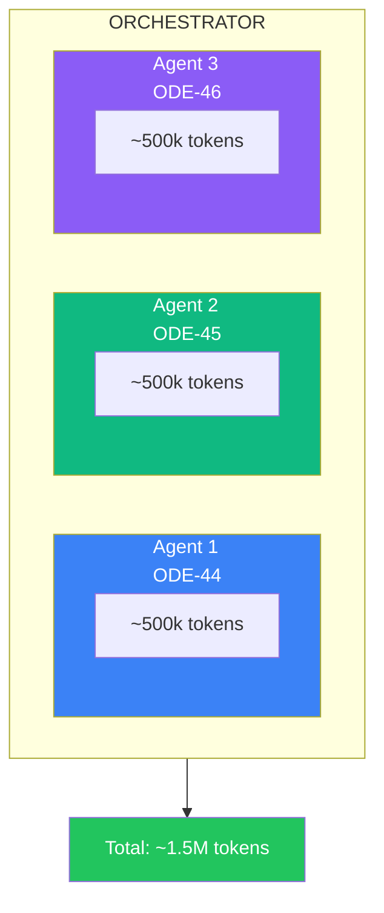
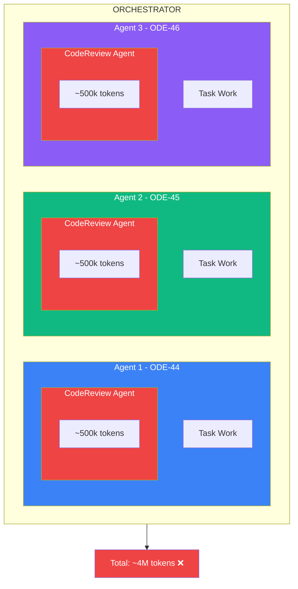
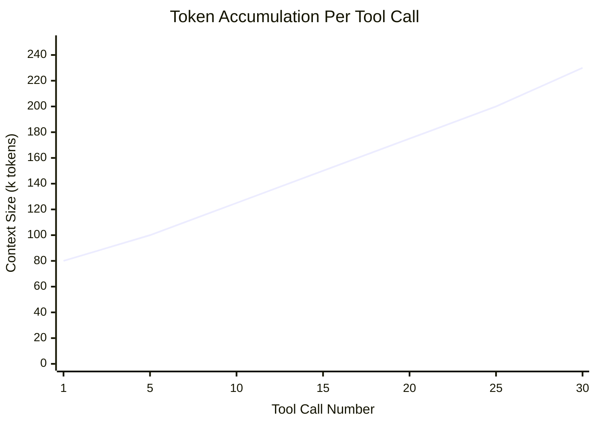
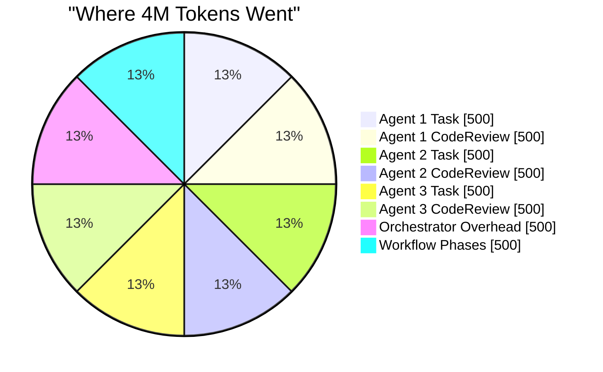
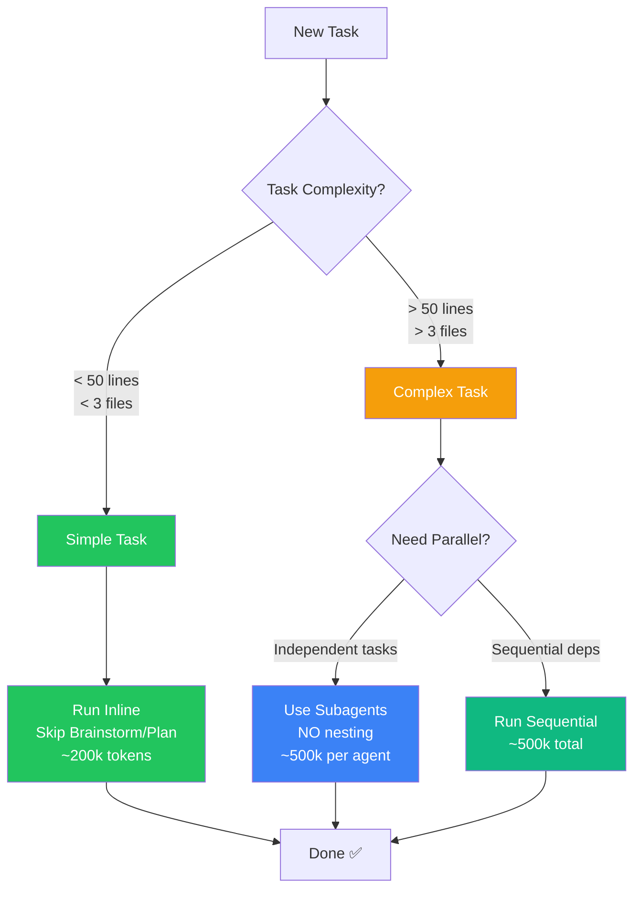

# Subagent Token Analysis - Mermaid Diagrams

Use these in blog platforms that support Mermaid (GitHub, Notion, many static site generators).

## Expected Architecture (3 Agents)

## Actual Architecture (6 Nested Agents)

## Token Accumulation (Triangle Problem)

## Cost Comparison

## Decision Flow: When to Use Subagents

